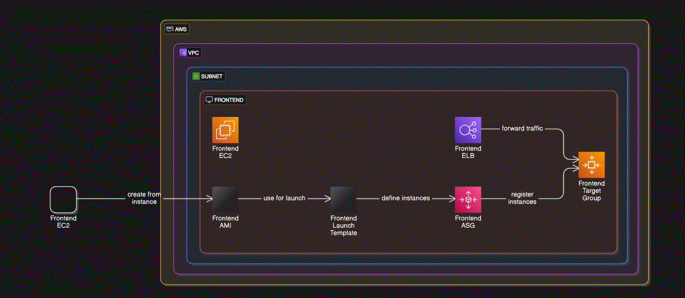

# Create Project Infra for 3-tier architecture app using Terraform modules

This Terraform configuration defines the infrastructure for the Expense Project. It creates an AWS environment with VPC, EC2 instances, RDS, Load Balancers, ACM certificates, Autoscaling, and other necessary components. The project follows a modular approach to organize the resources.

## Modules

### 1. **VPC Module**
   - **VPC Creation**: Creates the Virtual Private Cloud (VPC) with custom CIDR block.
   - **Subnets**: Defines public and private subnets across different availability zones.
   - **Internet Gateway (IGW)**: Attaches an IGW to the VPC for internet access.
   - **NAT Gateway**: Sets up a NAT Gateway for private subnet internet access.
   - **Route Tables**: Configures route tables for public and private subnets.
   - **Route Table Associations**: Associates route tables with the corresponding subnets.

### 2. **Security Groups Module**
   - **Frontend Security Group**: Defines security rules for the frontend instances.
   - **Backend Security Group**: Defines security rules for the backend instances.
   - **Database Security Group**: Configures access control for the MySQL RDS.
   - **Ansible Security Group**: Security rules for the Ansible server.
   - **Bastion Host Security Group**: Defines rules for Bastion host access.
   - **App Load Balancer Security Group**: Configures rules for backend load balancer.
   - **Frontend Load Balancer Security Group**: Configures rules for frontend load balancer.

### 3. **EC2 Instances**
   - **Bastion Host**: A bastion EC2 instance is created in the public subnet to allow secure access to the private subnet.
   - **Backend EC2 Instance**: The backend EC2 instance is created, configured via Ansible, and connected to the backend load balancer.
   - **Frontend EC2 Instance**: The frontend EC2 instance is created, configured, and connected to the frontend load balancer.

### 4. **RDS MySQL Service**
   - **RDS Instance**: A MySQL RDS instance is created in a private subnet and configured for database access.

### 5. **VPN Setup**
   - **VPN Gateway**: A VPN gateway is created for secure connections to the AWS infrastructure.

### 6. **Load Balancers**
   - **Backend Application Load Balancer**: Configured to distribute traffic across backend instances.
   - **Frontend Application Load Balancer**: Configured to distribute traffic across frontend instances.

### 7. **AWS ACM SSL Certificate**
   - **ACM Certificate**: An AWS Certificate Manager (ACM) certificate is created for secure communication over HTTPS for both frontend and backend load balancers.

### 8. **Auto Scaling**
   - **Launch Template**: Creates an AMI and launch template for backend and frontend EC2 instances.
   - **Auto Scaling Group**: Configures auto scaling for backend and frontend instances.
   - **Auto Scaling Policy**: Sets scaling policies based on CPU utilization or other parameters.
   - **Target Groups**: Target groups are created for load balancer routing.

### 9. **Load Balancer Listener Rules**
   - **Backend Listener**: Configures listener rules for directing traffic to the backend target group.
   - **Frontend Listener**: Configures listener rules for directing traffic to the frontend target group.

 
 below script for creating and destroy infra 

```
for i in $(ls -d */); do echo ${i%/}; cd ${i%/} ; terraform apply-auto-approve ; cd .. ; done

for i in $(ls -dr */); do echo ${i%/}; cd ${i%/} ; terraform destroy -auto-approve ; cd .. ; done

for i in 10-vpc 20-sg 30-bastion 40-rds 50-app-alb; do cd $i ; terraform apply -auto-approve ; cd ..; done  
```

terraform plan -target="aws_launch_template.backend"
terraform apply -target-"aws_launch_template.backend"

zeal vora for security 

create SSL/TLS certificates for secure communication which enables HTTPS for our websites and applications. ACM simplifies the process of provisioning, managing and deploying the certificates.

for validating our websites ownership and issueing certificates, ACM uses DNS validation and create a specific DNS record to our domain's configuration. ACM will then verifies. 

1. request ACM certificates
2. create Route 53 DNS records for validation
3. handle certificate validation